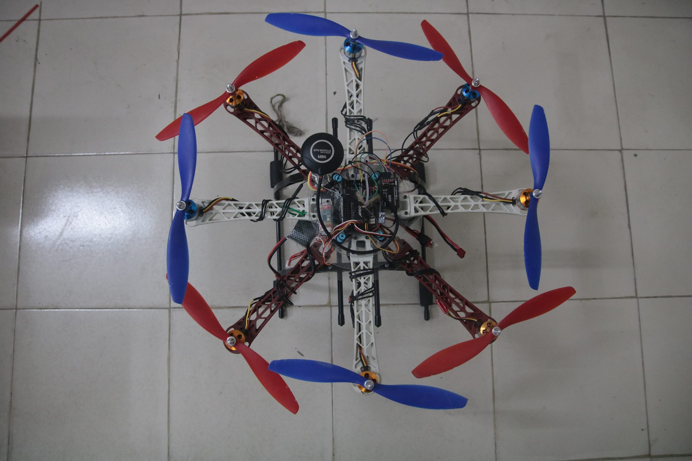
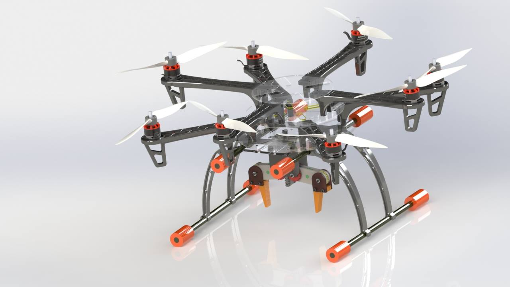
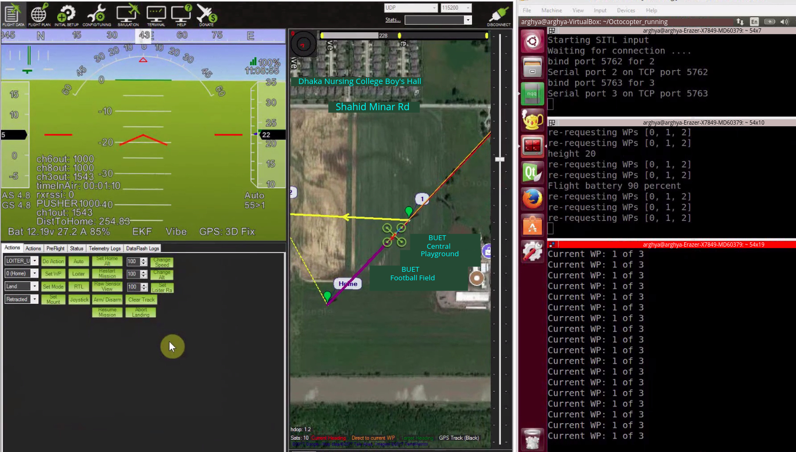

# Octocopter-for-fire-and-flood-management <br >

It's a Pixhawk & Raspberry Pi based remote controlled or autonomous 8-armed UAV which will fight as firefighter & work as flood relief distributor.

## Project Contributor
1. Arghya Chatterjee
2. Rumayel Hasan Pallock 
3. Boshra Aziz Roshni
4. Al Mamun
## Live Demo
For watching the copter in action, please visit [here](https://www.youtube.com/watch?v=dqQoOxy7XEo&list=PLVy6YSUUzzp0ME0aE1SHiJquqTTtoAA5Z).

## Delivery Mission Octocopter
<p float="left">
  
  
</p>

## Mission-Planner-for-Ground-Station

- Website : http://ardupilot.org/planner/  
- Forum : http://discuss.ardupilot.org/c/ground-control-software/mission-planner
- Download latest stable version : http://firmware.ardupilot.org/Tools/MissionPlanner/MissionPlanner-latest.msi
- Changelog : https://github.com/ArduPilot/MissionPlanner/blob/master/ChangeLog.txt  
- License : https://github.com/ArduPilot/MissionPlanner/blob/master/COPYING.txt  

## Mission Planner Overview
<p align="center">
  
</p>

## Launch on Windows

- Get the lastest zipped version of Mission Planner here : https://firmware.ardupilot.org/Tools/MissionPlanner/MissionPlanner-latest.zip
- Unzip in the directory you want
- Go into the directory
- run with: 
```
mono MissionPlanner.exe
```

You can debug Mission Planner on Mono with:
```
MONO_LOG_LEVEL=debug mono MissionPlanner.exe
```
## Compile On Linux

Those instructions were tested on Ubuntu 16.04.
Please install Mono, either :
```
sudo apt install mono-runtime libmono-system-windows-forms4.0-cil libmono-system-core4.0-cil libmono-winforms2.0-cil libmono-corlib2.0-cil libmono-system-management4.0-cil libmono-system-xml-linq4.0-cil
```

or full Mono :
```
sudo apt install mono-complete
```

## Face-Recognition-During-Delivery-Mission
<p align="center">
  
</p>

1. Update libraries: 
```
sudo apt-get update
sudo apt-get upgrade
```
2. Installing Face Recognition Module: 
```
sudo apt-get install build-essential cmake
sudo apt-get install python3-setuptools
sudo apt-get -y install python3-pip
sudo pip3 install dlib
sudo pip3 install face_recognition
```
3. Running the Delivery Recognition model:
```
cd ~/UAV Delivery Recognition 
python3 Drone_Delivery.py
```
