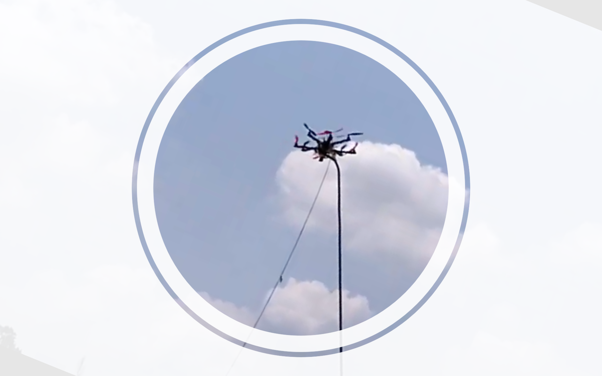

# Octocopter-for-fire-and-flood-management <br >

It's a remote controlled drone with 8 arms to fly and an additional arm to carry fire fighting hose pipe to throw water to fire affected area, and to carry food to people in flood affected area. For watching the copter in action, please visit: https://www.youtube.com/watch?v=dqQoOxy7XEo&list=PLVy6YSUUzzp0ME0aE1SHiJquqTTtoAA5Z

# Mission-Planner-for-Ground-Station

- Website : http://ardupilot.org/planner/  
- Forum : http://discuss.ardupilot.org/c/ground-control-software/mission-planner
- Download latest stable version : http://firmware.ardupilot.org/Tools/MissionPlanner/MissionPlanner-latest.msi
- Changelog : https://github.com/ArduPilot/MissionPlanner/blob/master/ChangeLog.txt  
- License : https://github.com/ArduPilot/MissionPlanner/blob/master/COPYING.txt  

## How to compile

### On Linux

#### Requirements

Those instructions were tested on Ubuntu 18.04.
Please install Mono, either :
```
sudo apt install mono-runtime libmono-system-windows-forms4.0-cil libmono-system-core4.0-cil libmono-winforms2.0-cil libmono-corlib2.0-cil libmono-system-management4.0-cil libmono-system-xml-linq4.0-cil
```

or full Mono :
```
sudo apt install mono-complete
```

#### Launching

- Get the lastest zipped version of Mission Planner here : https://firmware.ardupilot.org/Tools/MissionPlanner/MissionPlanner-latest.zip
- Unzip in the directory you want
- Go into the directory
- run with: 
```
mono MissionPlanner.exe
```

You can debug Mission Planner on Mono with:
```
MONO_LOG_LEVEL=debug mono MissionPlanner.exe
```

## Demo of Octocopter
<p float="left">
  
  
</p>

# Darknet-for-Object-Detection-by-Octocopter

For actual info regarding Darknet, visit <br >
Github page : https://github.com/AlexeyAB/darknet<br >
Website : https://pjreddie.com/darknet/  

1. Update libraries: 
```
sudo apt-get update
sudo apt-get upgrade
```
2. Export CUDA Path: 
```
export PATH=/usr/local/cuda-10.0/bin${PATH:+:${PATH}}
export LD_LIBRARY_PATH=/usr/local/cuda-10.0/lib64${LD_LIBRARY_PATH:+:${LD_LIBRARY_PATH}}
```
3. Installing Darknet: 
```
git clone https://github.com/ArghyaChatterjee/Octocopter-for-Fire-and-Flood-Management.git
cd darknet && wget https://pjreddie.com/media/files/yolov3-tiny.weights
make -j4
```
4. Running the model:
```
./darknet detector demo cfg/coco.data cfg/yolov3-tiny.cfg yolov3-tiny.weights -c 0
```
